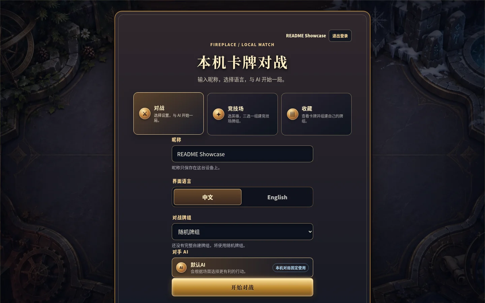
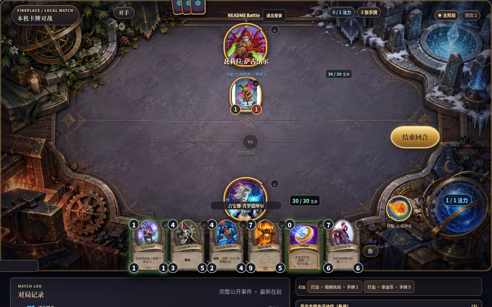
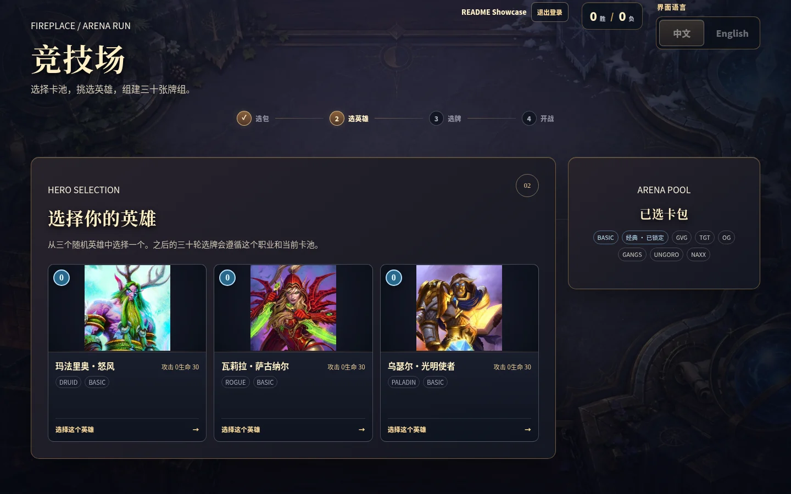
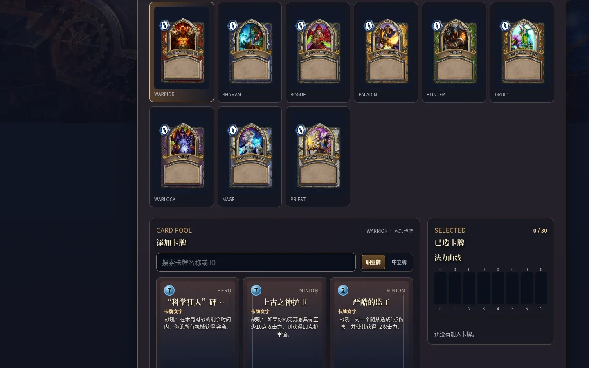
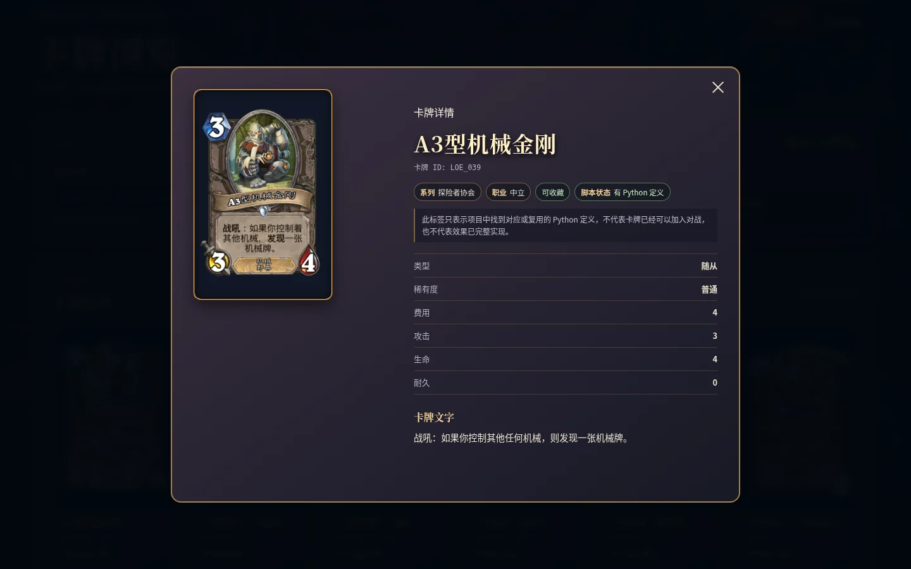
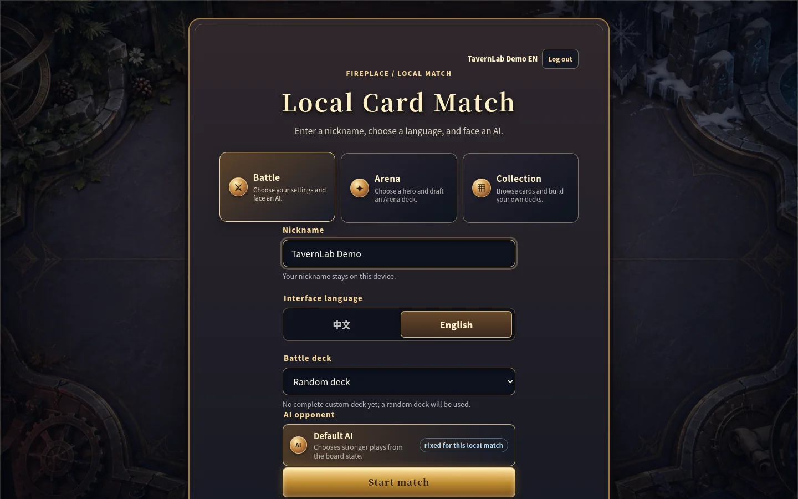
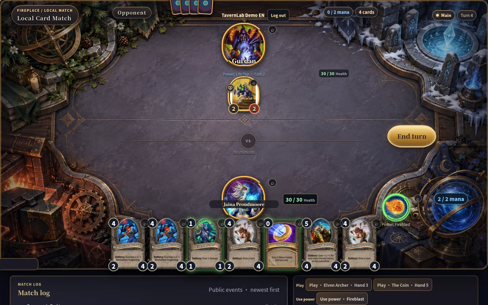
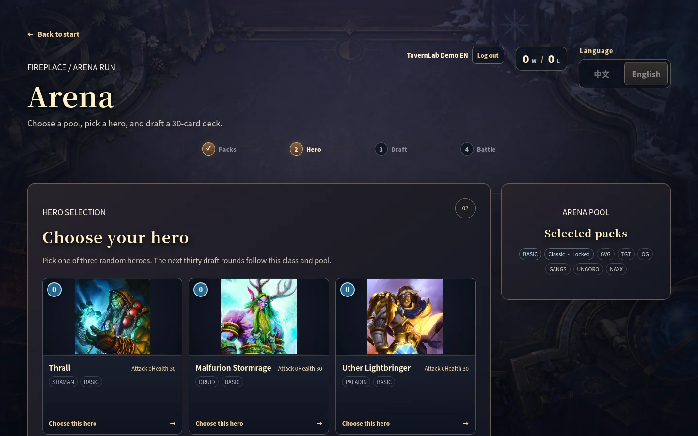
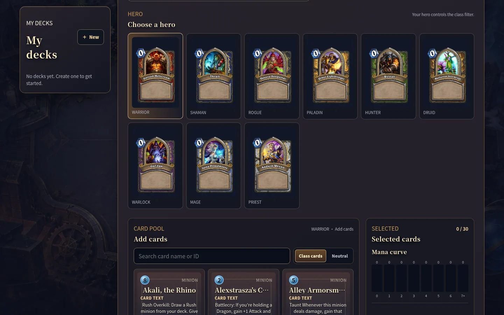
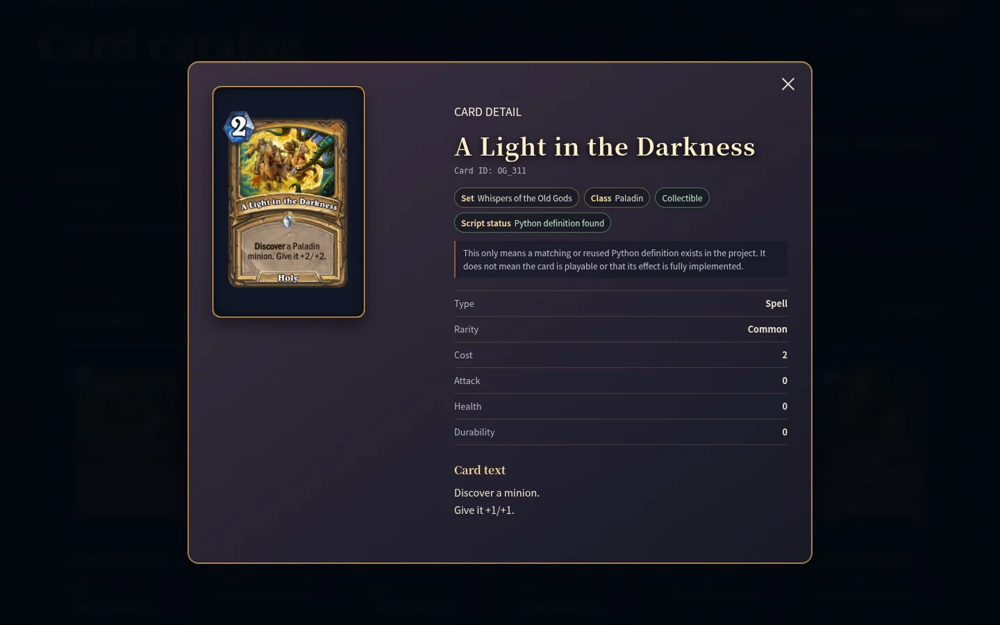

# TavernLab-HSsim

[中文](#中文) · [English](#english)

## 项目介绍 / Introduction

本项目是在 [HearthSim Fireplace](https://github.com/jleclanche/fireplace) 基础上继续开发的开源《炉石传说》本地模拟与 AI 实验项目。底层游戏规则、卡牌实体和大量基础模拟代码继承自 Fireplace；在此基础上，本项目增加了本机浏览器 GUI、竞技场、收藏与卡组管理、本地账号、多种 Agent/AI、对局日志与回放等功能。

项目目前主要面向本地模拟、历史版本体验和 AI/Agent 实验，不连接 Battle.net，也不以替代当前官方《炉石传说》客户端为目标。

This project is an open-source local Hearthstone simulator and AI experimentation platform developed on top of [HearthSim Fireplace](https://github.com/jleclanche/fireplace). Its core game rules, card entities, and a substantial part of the underlying simulation code are inherited from Fireplace. This project extends that foundation with a local browser GUI, Arena, collection and deck management, local accounts, multiple AI/agent controllers, game logging, and replay support.

The project is primarily intended for local simulation, historical Hearthstone environments, and AI/agent experimentation. It does not connect to Battle.net and is not intended to replace the current official Hearthstone client.

## 截图 / Screenshots

以下中英文截图来自本项目实际运行的本机界面，使用临时演示账号。界面内仍有部分 Fireplace 名称，Python 包与启动命令也继续使用 <code>fireplace</code>。

These Chinese and English screenshots come from the running local application with a temporary demo account. Some interface labels and the Python package/commands still use <code>fireplace</code>.

### 中文界面 / Chinese UI

| 开始界面 / Start screen | 对战 / Battle |
| --- | --- |
|  |  |
| 竞技场 / Arena | 收藏与组卡 / Collection and deck building |
|  |  |

卡牌浏览 / Card catalog:

### English UI / 英文界面

| Start screen | Battle |
| --- | --- |
|  |  |
| Arena | Collection and deck building |
|  |  |

Card catalog:

## 中文

### 当前功能状态

| 功能 | 状态 | 当前范围 |
| --- | --- | --- |
| 核心模拟与动作 API | 可用，持续完善 | 基于 Fireplace 的规则与实体；部分卡牌效果尚未完整实现。 |
| 浏览器对战 | 可用 | 本机单人与默认 AI 对战，可用随机牌组或完整的自建卡组。 |
| 竞技场 | 可用 | 选卡池、三选一选英雄、30 轮三选一选牌；7 胜或 3 负结束。 |
| 卡牌目录与收藏 | 可用 | 浏览、搜索、筛选历史卡牌资料，并创建和保存卡组；不是官方账号的卡牌库存。 |
| 本地账号 | 可用 | 用户名和密码登录；卡组、竞技场进度和活动对局按账号隔离。 |
| Agent/AI | 部分可用 | 框架含默认策略、随机策略和终端人工 Agent；浏览器目前只提供默认 AI 对手。 |
| 对局日志与回放 | 命令行可用 | 可记录对局；完整标准对局日志可在匹配的代码和卡牌数据版本下回放。 |
| 局域网/在线 PvP | 未实现 | 当前服务器只监听本机回环地址。 |

### 版本与卡牌支持范围

| 层次 | 当前范围 |
| --- | --- |
| 卡牌资料 | 仓库自带的 <code>CardDefs.xml</code> 是 build **53261**，对应历史 **Patch 17.6.0.53261**，不是当前官方卡池。目录中有 **2,507** 条可收集记录；全部 XML 范围有 **9,344** 条记录（包含衍生与不可收集实体）。 |
| 扩展包 | 资料覆盖基础、经典及多个历史扩展包，主要到**外域的灰烬**；通灵学园只有 **1** 条可收集记录，不能视为完整支持该扩展包。 |
| 卡牌效果 | 目录中的“有 Python 定义”只表示找到了对应或复用的代码定义，**不保证**效果完整、可正常加入对局或与官方规则完全一致；部分卡牌目前是白板。 |
| 竞技场卡池 | 基础与经典固定加入；另从当前列出的 **14 个大包、5 个小包**中使用 **16 点**选择扩展包（大包 3 点、小包 1 点）。当前提供 9 个经典职业英雄。 |

旧版 Fireplace README 的卡牌完成度百分比保存在[历史文档](LEGACY_FIREPLACE_README.md)，不代表 TavernLab-HSsim 当前的可玩效果覆盖率。

### 项目边界与声明

TavernLab-HSsim 是**免费、开源、非官方**的本地研究项目，源码按 [AGPL-3.0-or-later](LICENSE) 发布。项目继承并注明了上游 Fireplace；它与 Blizzard Entertainment 或 Battle.net 没有隶属关系，也未获其赞助或认可。《炉石传说》名称、图像及相关素材的权利归各自权利人所有。

项目不提供 Battle.net 登录、官方客户端兼容、局域网服务或在线匹配。当前的账号隔离只适用于这台本机服务器；卡牌资料范围和效果实现情况也不应被理解为现行官方《炉石传说》的完整复刻。

### 安装与启动

需要 **Python 3.10+** 和 [Git LFS](https://git-lfs.com/)；<code>CardDefs.xml</code> 使用 Git LFS。以下命令适用于 Linux 和 macOS：

~~~bash
git lfs install
git clone https://github.com/Hanqi-b/TavernLab-HSsim.git
cd TavernLab-HSsim
python3 -m venv venv
source venv/bin/activate
python -m pip install -e .
python -m fireplace.web_gui
~~~

在本机打开 [http://127.0.0.1:8765/](http://127.0.0.1:8765/)，注册本地账号后进入对战、竞技场或收藏。按 <code>Ctrl+C</code> 停止服务。可用 <code>--port 8766</code> 更改端口，或用 <code>--seed 7</code> 固定随机种子；安装后也可运行 <code>fireplace-web</code>。账号数据默认保存在 <code>~/.local/state/fireplace/</code>。

终端对战及回放：

~~~bash
python examples/human_vs_heuristic.py --seed 7 --log games/match.json
python examples/replay_log.py games/match.json
~~~

## English

### Current feature status

| Feature | Status | Current scope |
| --- | --- | --- |
| Simulation core and Action API | Available, evolving | Built on Fireplace rules and entities; some card effects remain incomplete. |
| Browser battles | Available | Local single-player matches against the default AI, using random or completed custom decks. |
| Arena | Available | Choose a pool, pick one of three heroes, draft 30 cards from three-card offers, and finish at seven wins or three losses. |
| Card catalog and Collection | Available | Browse, search, and filter historical card data; build and save decks. This is not an official account card inventory. |
| Local accounts | Available | Username/password sign-in; decks, Arena progress, and active matches are separated by account. |
| Agents/AI | Partly available | The framework has a heuristic policy, random policy, and terminal human agent; the browser currently offers only the default AI opponent. |
| Game logs and replay | Available in the CLI | Record games and replay complete standard logs with matching code and card-data versions. |
| LAN/online PvP | Not implemented | The server binds to the local loopback address only. |

### Version and card scope

| Layer | Current scope |
| --- | --- |
| Card data | Bundled <code>CardDefs.xml</code> is build **53261**, corresponding to historical **Patch 17.6.0.53261**, not today's official card pool. The catalog has **2,507** collectible records and **9,344** XML records in total, including generated and non-collectible entities. |
| Expansions | Data includes Basic, Classic, and historical sets mainly through **Ashes of Outland**. There is only **one** collectible Scholomance Academy record, so that set is not fully covered. |
| Card effects | A “Python definition” badge means a matching or reused definition was found. It **does not guarantee** a complete effect, normal playability, or exact official behavior. Some cards currently have no scripted effect. |
| Arena pool | Basic and Classic are always included. The selectable list has **14 large sets and 5 small sets** with a **16-point** budget (large: 3; small: 1). Nine classic heroes are available. |

The old Fireplace README's completion percentages are preserved in a [historical document](LEGACY_FIREPLACE_README.md). They do not measure TavernLab-HSsim's current playable effect coverage.

### Scope and disclaimer

TavernLab-HSsim is a **free, open-source, unofficial** local research project distributed under [AGPL-3.0-or-later](LICENSE). It builds on and credits upstream Fireplace. It is not affiliated with, sponsored by, or endorsed by Blizzard Entertainment or Battle.net. Hearthstone names, images, and related assets remain the property of their respective rights holders.

The project does not offer Battle.net login, official-client compatibility, LAN hosting, or online matchmaking. Account separation currently applies only to the local server. Its card data and effect coverage should not be read as a complete recreation of the current official Hearthstone game.

### Install and run

You need **Python 3.10+** and [Git LFS](https://git-lfs.com/); <code>CardDefs.xml</code> is stored with Git LFS. On Linux or macOS:

~~~bash
git lfs install
git clone https://github.com/Hanqi-b/TavernLab-HSsim.git
cd TavernLab-HSsim
python3 -m venv venv
source venv/bin/activate
python -m pip install -e .
python -m fireplace.web_gui
~~~

Open [http://127.0.0.1:8765/](http://127.0.0.1:8765/) on the same computer. Register a local account, then choose Battle, Arena, or Collection. Press <code>Ctrl+C</code> to stop the server. Use <code>--port 8766</code> for another port or <code>--seed 7</code> for reproducible random setup; <code>fireplace-web</code> is also available after installation. Account data is stored under <code>~/.local/state/fireplace/</code> by default.

Terminal play and replay:

~~~bash
python examples/human_vs_heuristic.py --seed 7 --log games/match.json
python examples/replay_log.py games/match.json
~~~
